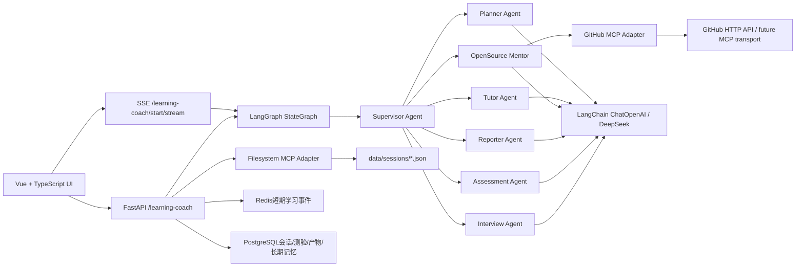
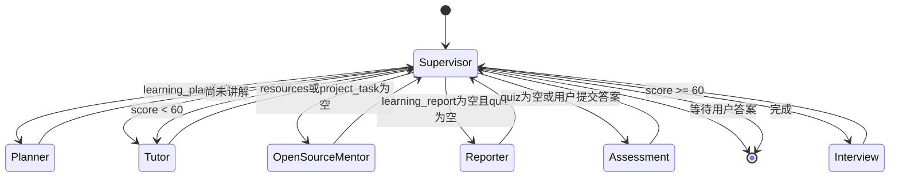

# AI Agent Learning Coach 架构

## 总体架构

## LangGraph 流程

## 关键设计

### Supervisor 使用规则路由

课程阶段和分数阈值属于业务约束，使用确定性规则比完全交给 LLM 更稳定、可测试。各专业 Agent 仍通过 LLM 生成内容；LLM 不可用或未配置密钥时使用确定性降级数据。

### SSE 进度流

`/learning-coach/start/stream` 使用 LangGraph `stream()` 输出节点级事件。前端通过原生 `EventSource` 接收 `session`、`agent`、`final`、`done` 事件，实时展示每个 Agent 的执行进度。

### OpenSource Mentor 合并项目教练

OpenSource Mentor 负责 GitHub 搜索、README 分析和作品集级项目任务生成，减少一个独立项目节点，让“开源参考 -> 项目任务”的链路更直接。

### MCP 边界

业务 Agent 只依赖 `GitHubMCPClient` 和 `FilesystemMCPClient` 的稳定方法，不依赖具体传输。当前 GitHub 适配器使用 HTTP API，后续可替换为官方 MCP stdio、SSE 或 Streamable HTTP 传输。

Filesystem 适配器把访问限制在 `COACH_DATA_DIR`，解析真实路径并阻止目录穿越，写入使用临时文件加原子替换。

### 状态持久化

Redis 保存带 TTL 的短期学习事件；PostgreSQL 是业务事实源，包含 `coach_sessions`、`coach_assessments`、`coach_artifacts`、`coach_memories`；Filesystem MCP 导出每个会话的完整 JSON。结构化长期记忆按 learner_id 隔离，并以权重排序注入下一次 Planner 输入。

## State 字段

核心字段：`user_goal`、`current_topic`、`learning_plan`、`resources`、`repo_analysis`、`project_task`、`learning_report`、`quiz`、`score`、`weak_points`、`interview_questions`、`next_action`、`messages`。

辅助字段：`session_id`、`tutor_content`、`user_answers`、`remediation_done`、`completed_agents`、`status`。
